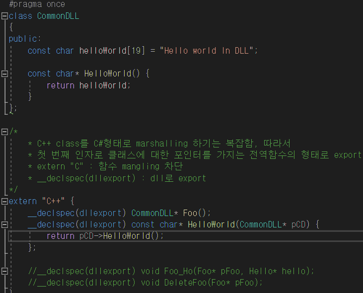
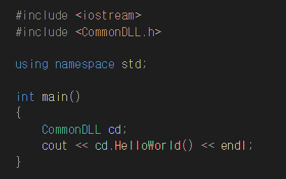

# CommonDLLMaker
DLL make Templete Setting for Unity, Unreal 

# useage
Clone It  
and open CommonDLL.sln

대략적인 설명 
https://www.evernote.com/l/ArDUa2BxTChP9p9xNfeyQR-ITe9e3T1II34/

# DLL Solution

# Test Solution

